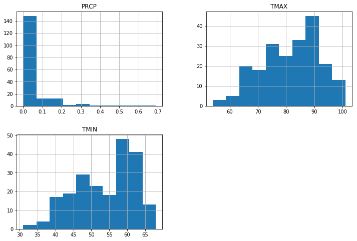
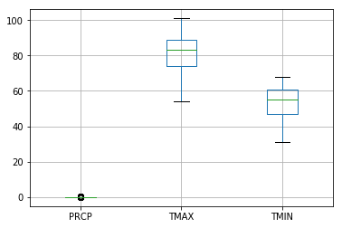
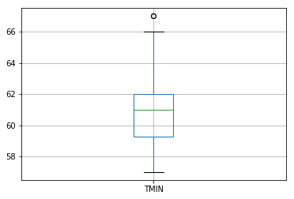
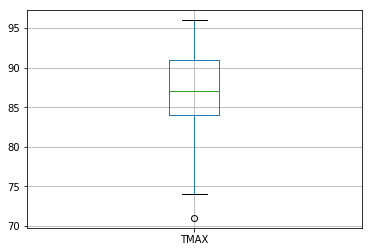

# Basic Statistics

### SWBATS

* Use Numpy and Pandas to compute summary statistics for measures of center and spread
* Apply summary statistics like mean and standard deviation to transformed data and compare results.
* Use graphical summaries (Histograms and Boxplots) to describe data spread and centre. 
* Describe the idea and rationale for inferential statistics.

First we need the necessary libraries


```python
import warnings
warnings.filterwarnings("ignore")

import numpy as np 
import pandas as pd
```

For this lab, we shall use a dataset covering temperature and weather values in Boulder city during the month of July 2017. The dataset has been taken from [National Oceanic and Atmospheric Administration's Climate website](https://www.climate.gov/). You can download other relevant climate related datsets [HERE](https://www.climate.gov/maps-data/datasets).

The data is stored in a .csv file called boulder_weather.csv. The dataset has been cleaned up so you can focus more on statistics, rather than data wrangling techniques.

Let's load this dataset into a pandas dataframe 


```python
file = 'boulder_weather.csv'

#Load the dataset into a dataframe 
weather = pd.read_csv(file)
```

Take a look at the first 10 rows of the DataFrame.


```python
weather.head(10)
```


<div>
<style scoped>
    .dataframe tbody tr th:only-of-type {
        vertical-align: middle;
    }

    .dataframe tbody tr th {
        vertical-align: top;
    }

    .dataframe thead th {
        text-align: right;
    }
</style>
<table border="1" class="dataframe">
  <thead>
    <tr style="text-align: right;">
      <th></th>
      <th>STATION</th>
      <th>NAME</th>
      <th>DATE</th>
      <th>PRCP</th>
      <th>TMAX</th>
      <th>TMIN</th>
    </tr>
  </thead>
  <tbody>
    <tr>
      <th>0</th>
      <td>USW00094075</td>
      <td>BOULDER 14 W, CO US</td>
      <td>2017-07-01</td>
      <td>0.00</td>
      <td>68.0</td>
      <td>31.0</td>
    </tr>
    <tr>
      <th>1</th>
      <td>USW00094075</td>
      <td>BOULDER 14 W, CO US</td>
      <td>2017-07-02</td>
      <td>0.00</td>
      <td>73.0</td>
      <td>35.0</td>
    </tr>
    <tr>
      <th>2</th>
      <td>USW00094075</td>
      <td>BOULDER 14 W, CO US</td>
      <td>2017-07-03</td>
      <td>0.00</td>
      <td>68.0</td>
      <td>46.0</td>
    </tr>
    <tr>
      <th>3</th>
      <td>USW00094075</td>
      <td>BOULDER 14 W, CO US</td>
      <td>2017-07-04</td>
      <td>0.05</td>
      <td>68.0</td>
      <td>43.0</td>
    </tr>
    <tr>
      <th>4</th>
      <td>USW00094075</td>
      <td>BOULDER 14 W, CO US</td>
      <td>2017-07-05</td>
      <td>0.01</td>
      <td>73.0</td>
      <td>40.0</td>
    </tr>
    <tr>
      <th>5</th>
      <td>USW00094075</td>
      <td>BOULDER 14 W, CO US</td>
      <td>2017-07-06</td>
      <td>0.00</td>
      <td>76.0</td>
      <td>48.0</td>
    </tr>
    <tr>
      <th>6</th>
      <td>USW00094075</td>
      <td>BOULDER 14 W, CO US</td>
      <td>2017-07-07</td>
      <td>0.02</td>
      <td>74.0</td>
      <td>43.0</td>
    </tr>
    <tr>
      <th>7</th>
      <td>USW00094075</td>
      <td>BOULDER 14 W, CO US</td>
      <td>2017-07-08</td>
      <td>0.00</td>
      <td>65.0</td>
      <td>44.0</td>
    </tr>
    <tr>
      <th>8</th>
      <td>USW00094075</td>
      <td>BOULDER 14 W, CO US</td>
      <td>2017-07-09</td>
      <td>0.01</td>
      <td>73.0</td>
      <td>39.0</td>
    </tr>
    <tr>
      <th>9</th>
      <td>USW00094075</td>
      <td>BOULDER 14 W, CO US</td>
      <td>2017-07-10</td>
      <td>0.01</td>
      <td>75.0</td>
      <td>44.0</td>
    </tr>
  </tbody>
</table>
</div>


Following is a description of columns you see in the dataset:

* STATION: The unique identification code for each weather station
* NAME: The location / name of the weather station
* DATE: The date of the observation
* PRCP: The precipitation (in inches)
* TMAX: The daily maximum temperature (in Fahrenheit)
* TMIN: The daily minimum temperature (in Fahrenheit)

From above we can see that the data has been collected from a number of weather stations (the NAME column). Use python's `set()` method identify a list of included weather stations. 


```python
# get a list of all weather stations.
list(set(weather["NAME"]))
```


    ['NIWOT, CO US',
     'BOULDER 14 W, CO US',
     'BOULDER, CO US',
     'GROSS RESERVOIR, CO US',
     'RALSTON RESERVOIR, CO US',
     'NORTHGLENN, CO US',
     'SUGARLOAF COLORADO, CO US']


### `pandas.DataFrame.loc()` function

Pandas `.loc()` function allows to access groups of rows and/or columns in a dataframe. This is a handy function for selecting subset(s) from a bigger datasets (think an SQL SELECT statement with a WHERE clause). More details can be viewed [HERE](https://medium.com/dunder-data/selecting-subsets-of-data-in-pandas-6fcd0170be9c). We shall use this function below to select data. Use this function with syntax given below 
> DataFrame.loc[CONDITION]

Using .loc() can help data scientists to avoid writing complex nested foor loops for iterating through a collection of information. It allows you to specify rows/columns with and required transformation gets applied applied to every element in the selection. We use this for a few exercises below. 

As we can see above that we have 7 unique weather stations in our dataset. Let's Extract the rows of the DataFrame concerned with the "RALSTON RESERVOIR" weather station. Store this data in a new DataFrame called `Ralston` and view first 5 rows of the data. 


```python
Ralston = weather.loc[weather.NAME == 'RALSTON RESERVOIR, CO US']
Ralston.head()

# STATION	NAME	DATE	PRCP	TMAX	TMIN
# 154	USC00056816	RALSTON RESERVOIR, CO US	2017-07-02	0.0	84.0	61.0
# 155	USC00056816	RALSTON RESERVOIR, CO US	2017-07-03	0.0	87.0	58.0
# 156	USC00056816	RALSTON RESERVOIR, CO US	2017-07-04	0.0	87.0	59.0
# 157	USC00056816	RALSTON RESERVOIR, CO US	2017-07-05	0.0	91.0	61.0
# 158	USC00056816	RALSTON RESERVOIR, CO US	2017-07-06	0.0	94.0	62.0
```


<div>
<style scoped>
    .dataframe tbody tr th:only-of-type {
        vertical-align: middle;
    }

    .dataframe tbody tr th {
        vertical-align: top;
    }

    .dataframe thead th {
        text-align: right;
    }
</style>
<table border="1" class="dataframe">
  <thead>
    <tr style="text-align: right;">
      <th></th>
      <th>STATION</th>
      <th>NAME</th>
      <th>DATE</th>
      <th>PRCP</th>
      <th>TMAX</th>
      <th>TMIN</th>
    </tr>
  </thead>
  <tbody>
    <tr>
      <th>154</th>
      <td>USC00056816</td>
      <td>RALSTON RESERVOIR, CO US</td>
      <td>2017-07-02</td>
      <td>0.0</td>
      <td>84.0</td>
      <td>61.0</td>
    </tr>
    <tr>
      <th>155</th>
      <td>USC00056816</td>
      <td>RALSTON RESERVOIR, CO US</td>
      <td>2017-07-03</td>
      <td>0.0</td>
      <td>87.0</td>
      <td>58.0</td>
    </tr>
    <tr>
      <th>156</th>
      <td>USC00056816</td>
      <td>RALSTON RESERVOIR, CO US</td>
      <td>2017-07-04</td>
      <td>0.0</td>
      <td>87.0</td>
      <td>59.0</td>
    </tr>
    <tr>
      <th>157</th>
      <td>USC00056816</td>
      <td>RALSTON RESERVOIR, CO US</td>
      <td>2017-07-05</td>
      <td>0.0</td>
      <td>91.0</td>
      <td>61.0</td>
    </tr>
    <tr>
      <th>158</th>
      <td>USC00056816</td>
      <td>RALSTON RESERVOIR, CO US</td>
      <td>2017-07-06</td>
      <td>0.0</td>
      <td>94.0</td>
      <td>62.0</td>
    </tr>
  </tbody>
</table>
</div>


### `pd.mean()`

Pandas has a built in functions to compute the mean of a dataset or a series -  `pd.mean( )`. All of these functions can be called either on a single Pandas Series (i.e. a column of a DataFrame) or on an entire DataFrame at one time.

Let's apply the `pd.mean()` function on the Ralston dataframe. 


```python
Ralston.mean()

# PRCP     0.042000
# TMAX    86.533333
# TMIN    61.166667
# dtype: float64
```


    PRCP     0.042000
    TMAX    86.533333
    TMIN    61.166667
    dtype: float64


Calculate the sample mean of the "maximum daily temperature" ONLY at Ralston weather station. 


```python
Ralston["TMAX"].mean()

# 86.53333333333333
```


    86.53333333333333


We can see that applying the `pd.mean()` function on complete dataset calculates the mean for every column found in the set. We can however, selectively identify column(s) as we saw above for mean calculation. 

### Other functions for summary statistics

Following is the list of functions that we can use to calculate other summary statistics.


Use above functions with Ralston dataframe and print 5-point summary statistics, along with mean and standard deviation.

Round off and print the results in a nice manner


```python
mean = Ralston["TMAX"].mean()
std = Ralston["TMAX"].std()
min_val = Ralston["TMAX"].min()
max_val = Ralston["TMAX"].max()
Q_1 = Ralston["TMAX"].quantile(.25)
Q_2 = Ralston["TMAX"].quantile(.50)
Q_3 = Ralston["TMAX"].quantile(.75)
print ("Mean:", round(mean,2))
print ("Standard deviation:", round(std,2) )
print("\n                  MIN      Q1       MEDIAN    Q2       MAX")
print("5-Number Summary: {:.2f}    {:.2f}    {:.2f}    {:.2f}    {:.2f}".format(min_val, Q_1, Q_2, Q_3, max_val))
```

    Mean: 86.53
    Standard deviation: 5.89
    
                      MIN      Q1       MEDIAN    Q2       MAX
    5-Number Summary: 71.00    84.00    87.00    91.00    96.00


### `pandas.DataFrame.describe()` for Summary Statistics 

What we see above could be a time consuming activity for a data scientist who may be interested in calculating such statistics frequently. Luckily, Pandas has a built-in function for this, called `.describe`. Let's apply this function to the Ralston dataset and see what it gives us.


```python
Ralston.describe()
```


<div>
<style scoped>
    .dataframe tbody tr th:only-of-type {
        vertical-align: middle;
    }

    .dataframe tbody tr th {
        vertical-align: top;
    }

    .dataframe thead th {
        text-align: right;
    }
</style>
<table border="1" class="dataframe">
  <thead>
    <tr style="text-align: right;">
      <th></th>
      <th>PRCP</th>
      <th>TMAX</th>
      <th>TMIN</th>
      <th>TMAXc</th>
      <th>TMINc</th>
      <th>T_DELTA</th>
    </tr>
  </thead>
  <tbody>
    <tr>
      <th>count</th>
      <td>30.000000</td>
      <td>30.000000</td>
      <td>30.000000</td>
      <td>30.000000</td>
      <td>30.000000</td>
      <td>30.000000</td>
    </tr>
    <tr>
      <th>mean</th>
      <td>0.042000</td>
      <td>86.533333</td>
      <td>61.166667</td>
      <td>30.296296</td>
      <td>16.203704</td>
      <td>25.366667</td>
    </tr>
    <tr>
      <th>std</th>
      <td>0.133453</td>
      <td>5.888231</td>
      <td>2.614065</td>
      <td>3.271239</td>
      <td>1.452258</td>
      <td>4.923437</td>
    </tr>
    <tr>
      <th>min</th>
      <td>0.000000</td>
      <td>71.000000</td>
      <td>57.000000</td>
      <td>21.666667</td>
      <td>13.888889</td>
      <td>14.000000</td>
    </tr>
    <tr>
      <th>25%</th>
      <td>0.000000</td>
      <td>84.000000</td>
      <td>59.250000</td>
      <td>28.888889</td>
      <td>15.138889</td>
      <td>23.000000</td>
    </tr>
    <tr>
      <th>50%</th>
      <td>0.000000</td>
      <td>87.000000</td>
      <td>61.000000</td>
      <td>30.555556</td>
      <td>16.111111</td>
      <td>25.000000</td>
    </tr>
    <tr>
      <th>75%</th>
      <td>0.000000</td>
      <td>91.000000</td>
      <td>62.000000</td>
      <td>32.777778</td>
      <td>16.666667</td>
      <td>28.000000</td>
    </tr>
    <tr>
      <th>max</th>
      <td>0.690000</td>
      <td>96.000000</td>
      <td>67.000000</td>
      <td>35.555556</td>
      <td>19.444444</td>
      <td>35.000000</td>
    </tr>
  </tbody>
</table>
</div>


And this is why we all love Pandas :)


## Data Transformations

Everytime we apply some transformation on a given dataset, the mean and variance of the data changes. We can watch this effect by applying some basic transformations to the subset we created above and try to learn how these impact the statistics. 

Lets run a loop and try to iteratively add some value (say 5), to  the column `TMAX` for 10 iterations and calculate mean and standard deviation for each iteration. Print the results for every iteration. 


```python
temp_df = Ralston.TMAX
for i in range(10):
    temp_df= temp_df + 5
    print ("Iteration",i+1,":", temp_df.mean(), temp_df.std())
```

    Iteration 1 : 91.53333333333333 5.888231004963722
    Iteration 2 : 96.53333333333333 5.888231004963722
    Iteration 3 : 101.53333333333333 5.888231004963722
    Iteration 4 : 106.53333333333333 5.888231004963722
    Iteration 5 : 111.53333333333333 5.888231004963722
    Iteration 6 : 116.53333333333333 5.888231004963722
    Iteration 7 : 121.53333333333333 5.888231004963722
    Iteration 8 : 126.53333333333333 5.888231004963722
    Iteration 9 : 131.53333333333333 5.888231004963722
    Iteration 10 : 136.53333333333333 5.888231004963722


Lets run another loop and multiply some value (2), to the column TMAX for 10 iterations and calculate mean and standard deviation for each iteration, just like above. Print the results for every iteration.


```python
temp_df2 = Ralston.TMAX
for i in range(10):
    temp_df2= temp_df2 * 2
    print ("Iteration",i+1,":", temp_df2.mean(), temp_df2.std())
```

    Iteration 1 : 173.06666666666666 11.776462009927444
    Iteration 2 : 346.1333333333333 23.55292401985489
    Iteration 3 : 692.2666666666667 47.10584803970978
    Iteration 4 : 1384.5333333333333 94.21169607941955
    Iteration 5 : 2769.0666666666666 188.4233921588391
    Iteration 6 : 5538.133333333333 376.8467843176782
    Iteration 7 : 11076.266666666666 753.6935686353564
    Iteration 8 : 22152.533333333333 1507.3871372707129
    Iteration 9 : 44305.066666666666 3014.7742745414257
    Iteration 10 : 88610.13333333333 6029.548549082851


> **Question** Describe the observed effect of multiplication and addition on mean and standard deviation. 

#### Mean with Addition ?
#### Standard deviation with Addition ?
#### Mean with Multiplcation ?
#### Standard Deviation with Multiplication ?

### Apply same transformation to different datasets

We Can can also try to apply similar transformation to different sets of data and observe the effect on mean and standard deviation. 

Let's convert the temperature values in TMAX and TMIN columns of Ralston dataframe from Farenhiet to Celcius using the formua: **C = 5/9(F - 32)**. Save the results in new columns of the dataframe. 

Hint: You can use the `.loc()` function to select and the required columns to read and write values. 


```python
Ralston.loc[:,"TMAXc"] = (5/9)*(Ralston.loc[:,"TMAX"] - 32)
Ralston.loc[:,"TMINc"] = (5/9)*(Ralston.loc[:,"TMIN"] - 32)
```

    /anaconda3/lib/python3.6/site-packages/pandas/core/indexing.py:357: SettingWithCopyWarning: 
    A value is trying to be set on a copy of a slice from a DataFrame.
    Try using .loc[row_indexer,col_indexer] = value instead
    
    See the caveats in the documentation: http://pandas.pydata.org/pandas-docs/stable/indexing.html#indexing-view-versus-copy
      self.obj[key] = _infer_fill_value(value)
    /anaconda3/lib/python3.6/site-packages/pandas/core/indexing.py:537: SettingWithCopyWarning: 
    A value is trying to be set on a copy of a slice from a DataFrame.
    Try using .loc[row_indexer,col_indexer] = value instead
    
    See the caveats in the documentation: http://pandas.pydata.org/pandas-docs/stable/indexing.html#indexing-view-versus-copy
      self.obj[item] = s


```python
Ralston.head()
```


<div>
<style scoped>
    .dataframe tbody tr th:only-of-type {
        vertical-align: middle;
    }

    .dataframe tbody tr th {
        vertical-align: top;
    }

    .dataframe thead th {
        text-align: right;
    }
</style>
<table border="1" class="dataframe">
  <thead>
    <tr style="text-align: right;">
      <th></th>
      <th>STATION</th>
      <th>NAME</th>
      <th>DATE</th>
      <th>PRCP</th>
      <th>TMAX</th>
      <th>TMIN</th>
      <th>TMAXc</th>
      <th>TMINc</th>
    </tr>
  </thead>
  <tbody>
    <tr>
      <th>154</th>
      <td>USC00056816</td>
      <td>RALSTON RESERVOIR, CO US</td>
      <td>2017-07-02</td>
      <td>0.0</td>
      <td>84.0</td>
      <td>61.0</td>
      <td>28.888889</td>
      <td>16.111111</td>
    </tr>
    <tr>
      <th>155</th>
      <td>USC00056816</td>
      <td>RALSTON RESERVOIR, CO US</td>
      <td>2017-07-03</td>
      <td>0.0</td>
      <td>87.0</td>
      <td>58.0</td>
      <td>30.555556</td>
      <td>14.444444</td>
    </tr>
    <tr>
      <th>156</th>
      <td>USC00056816</td>
      <td>RALSTON RESERVOIR, CO US</td>
      <td>2017-07-04</td>
      <td>0.0</td>
      <td>87.0</td>
      <td>59.0</td>
      <td>30.555556</td>
      <td>15.000000</td>
    </tr>
    <tr>
      <th>157</th>
      <td>USC00056816</td>
      <td>RALSTON RESERVOIR, CO US</td>
      <td>2017-07-05</td>
      <td>0.0</td>
      <td>91.0</td>
      <td>61.0</td>
      <td>32.777778</td>
      <td>16.111111</td>
    </tr>
    <tr>
      <th>158</th>
      <td>USC00056816</td>
      <td>RALSTON RESERVOIR, CO US</td>
      <td>2017-07-06</td>
      <td>0.0</td>
      <td>94.0</td>
      <td>62.0</td>
      <td>34.444444</td>
      <td>16.666667</td>
    </tr>
  </tbody>
</table>
</div>


Check for the change in standard deviation and mean going from Farenheit to centigrade and comment.


```python
print (Ralston.TMAX.mean(), Ralston.TMAXc.mean())
```

    86.53333333333333 30.296296296296298


```python
5/9*(86.53-32)
```


    30.294444444444448


```python
print (Ralston.TMAX.std(), Ralston.TMAXc.std())
```

    5.888231004963722 3.2712394472020674


```python
5/9*(5.88)
```


    3.2666666666666666


### Transformed features

Finally, lets do another quick experiment. Based on Ralston dataframe, calculate the delta for temperature values for TMAX and TMIN and store results in a newcolumn called T_DELTA.

Hint: Use `iloc()` as seen in previous examples.


```python
Ralston.loc[:,"T_DELTA"] = Ralston.loc[:,"TMAX"] - Ralston.loc[:,"TMIN"]
Ralston.head()
```

    /anaconda3/lib/python3.6/site-packages/pandas/core/indexing.py:537: SettingWithCopyWarning: 
    A value is trying to be set on a copy of a slice from a DataFrame.
    Try using .loc[row_indexer,col_indexer] = value instead
    
    See the caveats in the documentation: http://pandas.pydata.org/pandas-docs/stable/indexing.html#indexing-view-versus-copy
      self.obj[item] = s


<div>
<style scoped>
    .dataframe tbody tr th:only-of-type {
        vertical-align: middle;
    }

    .dataframe tbody tr th {
        vertical-align: top;
    }

    .dataframe thead th {
        text-align: right;
    }
</style>
<table border="1" class="dataframe">
  <thead>
    <tr style="text-align: right;">
      <th></th>
      <th>STATION</th>
      <th>NAME</th>
      <th>DATE</th>
      <th>PRCP</th>
      <th>TMAX</th>
      <th>TMIN</th>
      <th>TMAXc</th>
      <th>TMINc</th>
      <th>T_DELTA</th>
    </tr>
  </thead>
  <tbody>
    <tr>
      <th>154</th>
      <td>USC00056816</td>
      <td>RALSTON RESERVOIR, CO US</td>
      <td>2017-07-02</td>
      <td>0.0</td>
      <td>84.0</td>
      <td>61.0</td>
      <td>28.888889</td>
      <td>16.111111</td>
      <td>23.0</td>
    </tr>
    <tr>
      <th>155</th>
      <td>USC00056816</td>
      <td>RALSTON RESERVOIR, CO US</td>
      <td>2017-07-03</td>
      <td>0.0</td>
      <td>87.0</td>
      <td>58.0</td>
      <td>30.555556</td>
      <td>14.444444</td>
      <td>29.0</td>
    </tr>
    <tr>
      <th>156</th>
      <td>USC00056816</td>
      <td>RALSTON RESERVOIR, CO US</td>
      <td>2017-07-04</td>
      <td>0.0</td>
      <td>87.0</td>
      <td>59.0</td>
      <td>30.555556</td>
      <td>15.000000</td>
      <td>28.0</td>
    </tr>
    <tr>
      <th>157</th>
      <td>USC00056816</td>
      <td>RALSTON RESERVOIR, CO US</td>
      <td>2017-07-05</td>
      <td>0.0</td>
      <td>91.0</td>
      <td>61.0</td>
      <td>32.777778</td>
      <td>16.111111</td>
      <td>30.0</td>
    </tr>
    <tr>
      <th>158</th>
      <td>USC00056816</td>
      <td>RALSTON RESERVOIR, CO US</td>
      <td>2017-07-06</td>
      <td>0.0</td>
      <td>94.0</td>
      <td>62.0</td>
      <td>34.444444</td>
      <td>16.666667</td>
      <td>32.0</td>
    </tr>
  </tbody>
</table>
</div>


Answer following questions for above:

* Q1: Calculate the mean temperature difference in the month of July.
* Q2: Calculate difference of means between TMAX and TMIN daily temperature.
* Q3: Identify the relation between two values calculated above. 


```python
# Q1
print ('Mean difference:', Ralston["T_DELTA"].mean())

```

    Mean difference: 25.366666666666667


```python
# Q2
print ('Difference of means:', Ralston["TMAX"].mean() - Ralston["TMIN"].mean())
```

    Difference of means: 25.366666666666667


#### Observations : 

## Graphical Summaries

Histograms / Box and Whiskers plots are the most common ways to highlight the centr and spread of the data. We shall learn how to draw these using `matplotlib` library to describe the data in a graphical manner, along side summary statistics we saw earlier. 

### Histograms with `matplotlib.hist()`

Matplotlib library in python has a `.hist()` function, which comes in handy as it doesnt require you to do any data cleaning for initial observations and deals with null values automatically. Also , this function is integrated into Pandas as well, which means we can applhy this directly to pandas series and Dataframes. 

let's apply the hist() function to complete weather dataset. 


```python
import matplotlib.pylab as plt
fig, ax = plt.subplots(figsize=(12,8))

# Initialize figure and axis
weather.hist( ax = ax);
plt.show()
```





We can also apply this selectively to a given row or column of a dataframe


```python
fig, ax = plt.subplots(figsize=(8,4))

Ralston.hist(column="TMAX", ax=ax);

```


We can modify a lot of parameters of this histogram including bin size , axes, labels, rotation of columns etc. A detailed descriptions of these parameters can be viewed at [THIS LOCATION](https://pandas.pydata.org/pandas-docs/stable/generated/pandas.DataFrame.hist.html)

### Box and Whiskers Plots with `.boxplot()`

Pandas also comes packaged with a `.boxplot()` function to draw the box and whiskers plots for a given dataset or a selected series. Let's try to run it with TMAX in the complete dataset. 


```python


weather.boxplot()
```


    <matplotlib.axes._subplots.AxesSubplot at 0x116dd6da0>





Now let's see the box and whiskers plot for all TMIN values collected from Ralston weather station. 


```python
weather.loc[weather.NAME == 'RALSTON RESERVOIR, CO US'].boxplot(column="TMIN");
```





```python
weather.loc[weather.NAME == 'RALSTON RESERVOIR, CO US'].boxplot(column="TMAX");
```





Boxplots and histograms can be 'prettified' to a very detailed level using the arguments. 


## Inferential statistics 

Inferential statistics is one of the two main branches of statistics.

Inferential statistics use a random sample of data taken from a population to describe and make inferences about the population. Inferential statistics are valuable when examination of each member of an entire population is not convenient or possible. For example, to measure the diameter of each nail that is manufactured in a mill is impractical. You can measure the diameters of a representative random sample of nails. You can use the information from the sample to make generalizations about the diameters of all of the nails.

### Sampling with `DataFrame.sample()`

Pandas has a built in function for taking samples from a given population of data. we can use `.sample()` to define the fraction of sample (0 - 1) and sepficy whether we we want to sample WITH or WITHOUT replacement by setting replace argument to true or false.


```python
sample = pd.Series(weather.TMAX.sample(frac=0.1, replace=False))
sample.mean()
```


    82.71428571428571


```python
weather.TMAX.mean()
```


    81.4766355140187


```python
print ('Population mean:', weather.TMAX.mean())
for i in range(10):
    sample = pd.Series(weather.TMAX.sample(frac=(i+1)/10, replace=False))
    sample.mean()
    print ('Sample size:',sample.count(),'Sample mean:', sample.mean(),  'Difference:', sample.mean() - weather.TMAX.mean())
```

    Population mean: 81.4766355140187
    Sample size: 21 Sample mean: 82.42857142857143 Difference: 0.9519359145527346
    Sample size: 43 Sample mean: 79.93023255813954 Difference: -1.5464029558791594
    Sample size: 64 Sample mean: 80.796875 Difference: -0.679760514018696
    Sample size: 86 Sample mean: 83.31395348837209 Difference: 1.8373179743533967
    Sample size: 107 Sample mean: 81.71028037383178 Difference: 0.23364485981308292
    Sample size: 128 Sample mean: 81.015625 Difference: -0.46101051401869597
    Sample size: 150 Sample mean: 81.02666666666667 Difference: -0.44996884735202514
    Sample size: 171 Sample mean: 82.06432748538012 Difference: 0.5876919713614228
    Sample size: 193 Sample mean: 81.38860103626943 Difference: -0.08803447774926099
    Sample size: 214 Sample mean: 81.4766355140187 Difference: 0.0


As we can see, while taking samples, even with an increasing size, there is a difference between sample mean and population mean. In our dataset, this could be mainly due to some outliers getting randomly picked up in sample. This idea is known as **SAMPLING ERROR**. Due to noise in the data, there is always a difference between sample and population means and this could be problematic for our inference. 

This is where Hypothesis Testing comes into equation which allows us to test certain statistics for sample and infer about population with some level of confidence.

#### Bonus Exercise 1: 

Observe the effect on mean while taking samples with and without replacement. 

#### Bonus Exercise 2:

Itratively increase the size of a sample and observe the effect on the inference. 

### Summary: 
    
In this lab, we presented an introduction to descriptive statitics, using five point statistical summaries and descriptive visualisation techniques. We also introduced ourselves with the idea of statistical inference. Following labs will further explore some of these ideas and introduce some new ideas towards distributions and statistics.  
